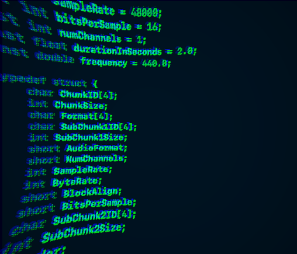

# audio-file-from-scratch-
Tiny program to write .wav files.

It also includes a sine tone generator, a white noise generator and an evelope shaper.

See documentation [here](https://benjaminbak.github.io/Portfolio/projects/audioFileFromScratch/index.html).
